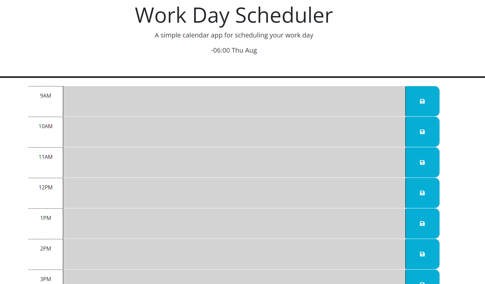

# workDayScheduler

3rd party API

## Description

Use this workday scheduler to schedule events!

## Screenshot:

## Table of Contents

- [Usage](#usage)
- [Contributors](#credits)
- [Questions](#gitUser)

## Usage

input events into time slots. And save them to local storage

## Badges

## Contributors

Adrian Franks, GitHub -> ACFcoding
Jacob Carver

## Questions

www.github.com/Walter-Conwell
walterdanteconwelljr@gmail.com
